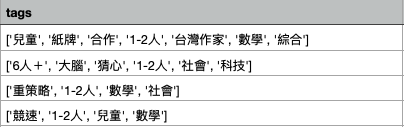
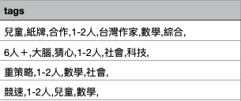

# Web Scraping Project

## Overview
It's a program I wrote to collect data from an online [boardgame store](http://www.swanpanasia.com/) based in Taiwan. 

## Script Development Process 
Before actually writing any codes, I'd  outline my plan and do some experiments as below: 
:one:  Identify the goal: the data I need and their data types for future database
:two:  Navigate the target website: observe its HTML and URL structure
:three: Experiment with different methods and time my codes 

For the script, it can be broken down into two major modules: web scraping and writing into CSV file. 

### I Web scraping

#### 1. Get all the product names and save it into a list
#### 2. Loop through the list and format them like so:  <small> "http://www.swanpanasia.com/products/{product's_english_name}" </small>

<small>
A. if it reaches the destination successfully (HTTP response status code returns 200), do the following: 

* give it a product Id (as primary key for future database)
* save product tags as a string list
* save its image url
* save description as a string
* save prices as integer 
* save additional info as a string list


B. if it fails to reach the destination (HTTP response status code returns 400 or 404), do the following: 

* Give it a product Id as 0 (and it will be removed later by its id)
* Print out the product's English name, in order to handle that in the future, but for now I just remove them

</small>

#### 3. Print out success count and failure count
#### 4. Save the completed data as a list of dictionaries, and delete data that is incomplete
#### 5. Print the length of total data, which should match the success count above

<small> The final result should be something like the following : </small>
```
[
   {'eng_name': '10-dwarves',
  'ch_name': '矮人十兄弟',
  'img_src': 'https://something.jpg',
  'pId': 1,
  'description': '這些礦工矮人們整天在坑道中挖掘寶石，雖然累積的財富無數，但長年灰頭土臉，生活習慣相當糟糕，衛生兩字他們從沒聽過。自從白雪公主來了以後，豐盛的晚餐上桌前，必定要求他們將手洗淨，但是，頑固的矮人們由於長相穿著都很相似，經常魚目混珠、瞞騙公主。',
  'tags': ['兒童', '紙牌', '合作', '1-2人', '台灣作家', '數學', '綜合'],
  'price': 120,
  'notes': ['8歲以上', '2-4人', '10分鐘']},
  
 {'eng_name': '13-clues',
  'ch_name': '13道線索',
  'img_src': 'https://something.jpg',
  'pId': 2,
  'description': '數起兇殘的犯罪案件震驚了1899年的倫敦，謎樣的案情掩蓋了真相，蘇格蘭警場在黑暗中摸索，號召一群優秀的偵探前來協助破案。每位偵探必須利用敏銳的直覺，從13道線索中找出蛛絲馬跡，負責解開自己的謎題，比其他人更快偵破自己的案件！',
  'tags': ['6人＋', '大腦', '猜心', '1-2人', '社會', '科技'],
  'price': 990,
  'notes': ['8歲以上', '2-6人', '30分鐘']},
]
```

### II Compile to CSV file

#### 1. Write the first row as header 
#### 2. To avoid square brackets showing in the cells, an extra function is needed to convert string list into string like so: 

Instead of this: 

to be this: 


## Future Improvement
- Implement generators to be more memory efficient
- Minimize the use of for loops to speed up performance

